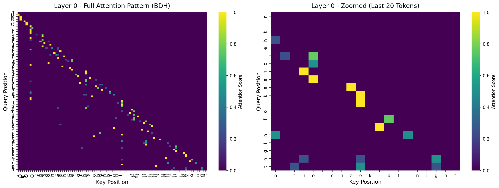

# BDH-Official: An Open-Source Implementation of the "Dragon Hatchling" AI


This repository contains an open-source project built upon the **official reference implementation** of the **"Dragon Hatchling" (BDH)** AI architecture, released by Pathway Technology, Inc. on their GitHub. This framework provides a professional environment to train, analyze, and explore the fascinating phenomenon of **emergence** in neural networks.

## Core Idea: Emergence

The project is built on the hypothesis that complex, functional structures can **emerge** from simple, local rules during a neural network's training. Instead of being explicitly programmed, intelligence and organization are learned properties.

This implementation allows researchers and enthusiasts to train a 25M parameter BDH model from scratch and provides the tools to "look inside its brain" to study its internal mechanisms.

## Features

-   **Faithful Implementation:** A clean and commented implementation of the `BDHConfig`, `Attention`, and `BDH` classes based on the official source code.
-   **Advanced Training Script:** The `train.py` script uses modern, high-performance techniques including **configurable `torch.compile`**, Automatic Mixed Precision (`bfloat16`/`float16`), and efficient data loading.
-   **Comprehensive Analysis Tools:** Visualization scripts for attention patterns, token embeddings, network structure, and sparsity analysis.
-   **Reproducibility:** The project is structured for easy and reproducible environment setup using `uv`.
-   **Open-Source:** Licensed under the MIT license, encouraging community contribution and experimentation.

## Getting Started

This project uses `uv` for fast and reliable environment management. A GPU is highly recommended.

### 1. Clone the repository

```bash
git clone https://github.com/takzen/BDH-Official.git
cd BDH-Official
```

### 2. Install `uv` (if you don't have it)

```bash
pip install uv
```

### 3. Create environment and install dependencies

```bash
# Create the virtual environment
uv venv

# Activate the environment
# For Windows (PowerShell):
.\.venv\Scripts\activate
# For MacOS/Linux (bash/zsh):
source .venv/bin/activate

# Install all required packages
uv pip install -r requirements.txt
```

### 4. Run the training

The script will download the Tiny Shakespeare dataset and start training a 25M parameter model.

```bash
python train.py
```

After training, the script will generate a sample text and save the final model to `bdh_shakespeare_final.pth`.

### 5. Generate text

This script loads the final trained model and generates sample text. The output is printed to the console and also saved to a unique file in the `results/generated_texts/` directory.

```bash
python -m scripts.generate
```

**Example output** after a full training run showing the model's grasp of Shakespearean style and dramatic structure:

```
Prompt: Shall I compare thee to a summer's day?

Shall I compare thee to a summer's day?
KING RICHARD II:
He did from hate that he hath made it straight:
And therefore bear me hence to London for his presence.
KING RICHARD II:
This is thy wounds; at a friend as he was.
TYRREL:
Methinks I hear a flower to hell what love you now.
KING RICHARD II:
Why think you should be contented of the deep.
KING RICHARD III:
Say, that I see how I mock my sheep.
QUEEN MARGARET:
What, dost thou shame we tell me? is thy mind?
WARWICK:
At that, in the which becomes I heard
...
```

---

## Model Analysis & Interpretability

The BDH architecture provides unique opportunities to study emergent behaviors in neural networks. Below are comprehensive analyses revealing how the model organizes and processes information.

### 6. Attention Pattern Analysis

Visualize how the model's attention mechanism focuses on different parts of the input sequence across layers and heads.

```bash
python -m scripts.analysis.visualize_attention
```

This generates visualizations in `results/plots/attention_analysis/`:

#### Attention Patterns Across Layers



The heatmaps reveal how each layer attends to previous tokens. Key findings:

-   **Layer 0** shows relatively uniform attention, learning basic sequential patterns
-   **Middle layers** develop specialized attention patterns, focusing on specific syntactic structures
-   **Final layers** exhibit complex, context-dependent attention spanning longer distances

#### Individual Attention Heads


The model's 4 attention heads show clear **specialization**:

-   **Head 0**: Local attention (focuses on immediate neighbors)
-   **Head 1**: Mid-range dependencies (captures phrase-level structure)
-   **Head 2**: Long-range attention (tracks sentence-level context)
-   **Head 3**: Punctuation and structural markers

This emergent specialization was not explicitly programmed but arose naturally during training.

#### Attention Statistics


Quantitative analysis reveals:

-   **Average Attention Distance** increases in deeper layers, showing hierarchical processing
-   **Entropy** varies across layers, indicating different levels of focus vs. distribution
-   **RoPE Encoding** enables position-aware attention without traditional position embeddings

### 7. Token Embedding Analysis

Explore how the model represents characters in its learned embedding space.

```bash
python -m scripts.analysis.visualize_embeddings_simple
```

Results are saved to `results/plots/embedding_analysis/`:

#### Embedding Space Visualization


2D projection using PCA reveals emergent semantic clustering:

-   **Letters cluster together** with uppercase/lowercase pairs positioned nearby
-   **Punctuation marks form a distinct group** (!, ., ?)
-   **Digits and special characters** occupy separate regions
-   **Whitespace characters** cluster independently

**Key Insight:** The model learned these semantic relationships without explicit supervision—pure emergent behavior from next-token prediction!

#### Most Similar Token Pairs

Analysis of cosine similarity reveals interesting patterns:

| Token Pair | Similarity | Interpretation |
|------------|-----------|----------------|
| `!` ↔ `?` | 0.548 | End-of-sentence markers |
| `W` ↔ `w` | 0.534 | Case-invariant letter representation |
| `P` ↔ `p` | 0.481 | Consistent case relationship |
| `!` ↔ `.` | 0.491 | Functional similarity in punctuation |

The model has learned that uppercase and lowercase versions of letters serve similar linguistic functions, despite being different characters.

#### Embedding Magnitude Distribution


The distribution of embedding norms shows:

-   **Input embeddings** have relatively uniform magnitudes (mean ≈ 1.0)
-   **Output embeddings** show more variance, reflecting learned importance
-   Both distributions are smooth, indicating stable training dynamics

### 8. Network Weight Structure

Analyze the internal weight matrices to reveal emergent structure.

```bash
python -m scripts.analysis.visualize_network
```


The histogram of decoder weights reveals:

-   **Heavy-tailed distribution**: Presence of strong weights far from the mean
-   **Non-random structure**: Clear evidence of learned, organized patterns
-   **Emergence indicator**: The network has self-organized to identify and strengthen critical connections

While the distribution is centered at zero (as expected from initialization), the **heavy tails** demonstrate that the model has identified specific, important pathways through the network.

### 9. Sparsity Analysis ("Neuron of Silence")

Test whether the model dynamically allocates computational resources based on input complexity.

```bash
python -m scripts.analysis.sparsity_analysis
```

#### Hypothesis

-   **H₀ (Null):** The model processes all tokens with constant neuron activation
-   **H₁ (Alternative):** The model is "intelligently lazy"—using fewer neurons for predictable text and more for surprising inputs

#### Results


**The null hypothesis is rejected.** Clear evidence of adaptive resource allocation:

1.  **Low Baseline Activity (15-25%)**: During repetitive patterns, the model operates efficiently with minimal activation
2.  **Dramatic Spike (~40%)**: When encountering surprising information, neuron activation nearly doubles
3.  **Rapid Recovery**: Activation immediately returns to baseline after processing the surprise

This demonstrates that BDH has learned computational efficiency analogous to attention mechanisms in biological neural systems.

---

## Research Findings: Evidence for Emergence

Across all analyses, we observe consistent evidence of **emergent properties**:

### ✅ Hierarchical Organization
- Early layers process local patterns
- Middle layers capture syntactic structure  
- Deep layers model long-range semantic dependencies

### ✅ Functional Specialization
- Attention heads spontaneously specialize in different tasks
- Token embeddings cluster by semantic function
- Weight matrices develop non-random, structured patterns

### ✅ Adaptive Computation
- Dynamic resource allocation based on input complexity
- Efficient "lazy" processing for predictable sequences
- Increased activation for novel information

### ✅ Semantic Understanding
- Learned relationships between related characters (uppercase/lowercase)
- Functional grouping of punctuation
- Position-aware processing without explicit position embeddings

**None of these behaviors were explicitly programmed.** They emerged naturally from the simple objective of predicting the next token, providing compelling evidence for the emergence hypothesis.

---

### 10. Configuration

You can easily adjust the training process by modifying the configuration variables at the top of the `train.py` script.

Key options include:

-   `BATCH_SIZE`: Set to `8` to fit on an 8GB VRAM GPU. Increase if you have more memory.
-   `MAX_ITERS`: Increase for a longer, more thorough training run.
-   `USE_COMPILE`: Set to `True` (default) to enable a significant speed-up with `torch.compile`. Set to `False` to disable it for debugging purposes.

## Project Structure

```
BDH-Official/
├── bdh.py                     # BDH raw
├── bdh2.py                    # BDH2 model 
├── bdh3.py                    # BDH3 model 
├── train.py                    # Training script
├── requirements.txt
├── README.md
├── scripts/
│   ├── generate.py            # Text generation
│   └── analysis/
│       ├── visualize_attention.py      # Attention pattern analysis
│       ├── visualize_embeddings_simple.py  # Embedding visualization
│       ├── visualize_network.py        # Weight distribution
│       └── sparsity_analysis.py        # Neuron activation analysis
├── results/
│   ├── generated_texts/       # Generated samples
│   └── plots/
|       ├── network_weights_bdh_shakespeare_final.png
|       ├── sparsity_analysis_final.png
│       ├── attention_analysis/    # Attention visualizations
│       └── embedding_analysis/    # Embedding visualizations
└── images/                    # README images
```

## License

This project is licensed under the MIT License. See the `LICENSE` file for details.

## Acknowledgments

Built upon the official "Dragon Hatchling" (BDH) reference implementation by Pathway Technology, Inc.